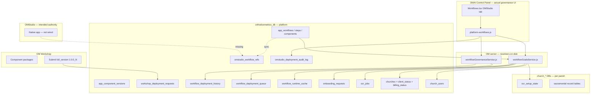
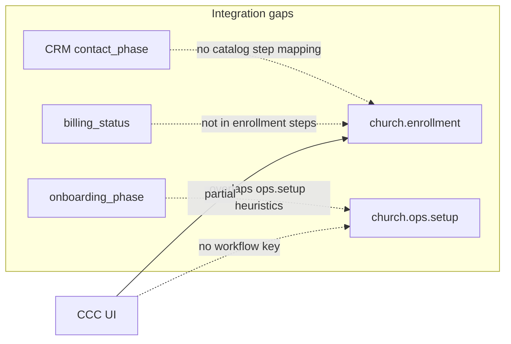
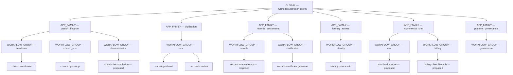
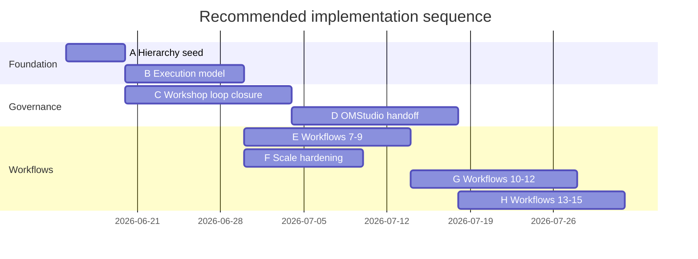

# Workflow Catalog — Architecture Gap Analysis

**Date:** 2026-06-12  
**Type:** Design review — no implementation  
**Scope:** Workflow catalog vs broader OM platform architecture (Workshop, OMStudio, OMAI, OM parish apps, CRM, billing, multi-tenant scale)  
**Inputs reviewed:**
- [app-workflow-catalog-pipeline.md](./app-workflow-catalog-pipeline.md)
- [workflow-catalog-review-implementation.md](./workflow-catalog-review-implementation.md)
- [workflow-catalog-open-questions.md](./workflow-catalog-open-questions.md)
- Schema: `20260608_app_workflow_catalog.sql`, `20260609_app_workflow_catalog_phase_b.sql`, `20260612_workflow_catalog_review_decisions.sql`
- Services: `workflowGoalsService.js`, `workflowGovernanceService.js`, `workflowRuntimeCacheService.js`, `workflowCatalogService.js`
- OMAI: `platform-workflows.js`, `Workflows.tsx`
- Platform features: `featureRegistry.ts`, CRM/CCC, `church-decom.js`, `onboardingService.js`

---

## Executive summary

The workflow catalog is a **strong definition layer** (6 filed workflows, resolvers, goals, partial governance) but remains a **thin runtime and promotion layer** relative to the full OM platform. It correctly replaces legacy `platform_workflows` / `prompt_workflows` for *business process documentation*, yet:

1. **Workshop `_1/_2/_3` versioning** exists in schema (`app_component_versions`, `workshop_deployment_requests`) but is **not closed-loop** with approve → deploy → active version → rollback.
2. **OMStudio** is named as governance authority but **OMAI Control Panel** is the actual approve consumer; OMStudio native app integration is absent.
3. **Hierarchy primitives** (`app_workflow_system_levels` with `GLOBAL`, `APP_FAMILY`, `parent_level_key`) are **underused** — only flat `WORKFLOW_GROUP` buckets exist.
4. **~60% of parish platform capabilities** (manual entry, billing, CRM nurture, decommission, email intake, audits) have **no filed workflow**.
5. **Execution state** is **ad hoc** across platform tables, church columns, and per-tenant DB tables — no unified `workflow_execution` model for scale.

**Recommendation:** Introduce a **three-tier model** — **Workflow Domains → Workflow Families → Workflows** — backed by **platform execution state** for cross-tenant queries and **tenant execution pointers** for church-specific runtime, with OMStudio as the sole promotion authority and Workshop builds driving `app_component_versions` increments.

---

## 1. Current architecture (as-built)



### Filed workflows today (6)

| Key | Group | Runtime source | Execution DB |
|-----|-------|----------------|--------------|
| `church.enrollment` | enrollment | `onboarding_requests.status` | Platform |
| `church.ops.setup` | church_ops | `churches.*` heuristics | Platform |
| `ocr.setup.wizard` | ocr | `ocr_setup_state` | Tenant |
| `ocr.batch.review` | ocr | `ocr_jobs.review_status` | Platform |
| `records.certificate.generate` | records | `generated_certificates` + church records | Platform + tenant |
| `identity.user.admin` | identity | `church_users` + `users.is_locked` | Platform |

---

## 2. Architecture findings

### 2.1 Workshop component lifecycle (`_1`, `_2`, `_3` model)

**Designed model (schema):**

| Artifact | Field | Intent |
|----------|-------|--------|
| `workshop_deployment_requests` | `semantic_version`, `workshop_build_number`, `full_version` | Workshop submit packages as `1.0.0_3` |
| `app_component_versions` | `full_version`, `deployment_status` | Ledger of staged/active/rolled_back per target app |
| `app_workflow_step_components` | `component_key`, `source_path` | Catalog binding step → component |

**As-built behavior:**

- Phase B migration **seeded all existing components as `1.0.0_1` active** — good baseline.
- Workshop submit (OMAI UI) **inserts `workshop_deployment_requests`** with `full_version`.
- Approve flow **validates** version format and writes `workflow_deployment_history` + queue row.
- Approve **does not**:
  - Insert/update `app_component_versions` with `_2`, `_3`, …
  - Copy artifacts to OM/OMAI/OMStudio filesystems
  - Bind deployed version to `app_workflow_step_components` or active workflow version
  - Mark prior version `rolled_back` on promotion
  - Link `component_key` in request to catalog `component_key` with FK integrity

**Finding:** The `_N` build model is **documentation-complete, operationally incomplete**. Workshop and catalog share vocabulary but not a **single promotion state machine**.

**Alignment score:** **35%** — schema aligned; runtime promotion loop not aligned.

---

### 2.2 OMStudio as authoritative governance

**Intended:** Workshop → OMStudio approve → OM deploy (roadmap Step 2).

**As-built:**

| Capability | OMStudio native | OMAI CP proxy |
|------------|-----------------|---------------|
| Workflow refs sync | — | `GET /platform/workflow-refs` |
| Deployment inbox | — | `Workflows.tsx` refs tab |
| Approve/reject | — | `POST .../deployment-requests/:id/approve` |
| Authority manifest | API exists | `GET /platform/governance/workflow-authority` |
| Documentation authority | Listed in manifest | Docs live in OM repo only |
| Audit trail | `omstudio_deployment_audit_log` | Same + `workflow_deployment_history` |

**Finding:** OMStudio is **architecturally designated** but **not operationally authoritative**. OMAI is a **governance proxy**. Risk: two operators, two UIs, divergent audit semantics.

**Alignment score:** **25%** — foundations only; authority not transferred.

---

### 2.3 Missing meta-layer: groups, domains, inheritance, org hierarchy

**Schema supports but does not populate:**

```sql
app_workflow_system_levels.system_level ENUM(
  'GLOBAL','APP_FAMILY','APP_SERVER','APP_DATABASE',
  'WORKFLOW_GROUP','WORKFLOW','WORKFLOW_STEP','COMPONENT'
)
parent_level_key VARCHAR(64) NULL
```

**Seeded today:** Only `WORKFLOW_GROUP` rows (`enrollment`, `ocr`, `records`, `identity`, `church_ops`).

**Not used:**

- `GLOBAL` — no platform-wide workflow system root
- `APP_FAMILY` — no OM / OMAI / Workshop / OMStudio family nodes
- `parent_level_key` — no tree (flat groups)
- Workflow **inheritance** — no base workflow / extends model
- **Organizational unit** hierarchy — jurisdiction → diocese → parish not mapped to workflow scope
- `app_workflow_policies` + assignments — scaffolded, **zero policies seeded**

**Parallel legacy:** `workflow_templates` / `workflow_template_*` (prompt/AI workflow engine) still exists in codebase tests — **not integrated** with `app_workflows` catalog.

**Finding:** Catalog is **flat workflow list under shallow groups**. Missing **domain** and **system** layers needed for 15+ workflows and multi-app governance.

---

### 2.4 Missing workflow categories (church management platform)

Capabilities with **production code** but **no catalog workflow**:

| Domain | Capability (exists in OM/OMAI) | Gap severity |
|--------|-------------------------------|--------------|
| **Records** | Manual baptism/marriage/funeral entry (`/portal/records/*/new`) | **Critical** — daily parish operation |
| **Commercial** | `billing_status`, `paid_at`, enrollment payment branch | **Critical** — revenue lifecycle |
| **CRM** | `omai_crm_leads`, `contact_phase`, CCC follow-ups | **High** — pre-onboarded ~80 parishes |
| **Lifecycle** | `client_status` machine, `onboarding_phase` 1–5 | **High** — parallel to catalog, not unified |
| **Risk** | `church-decom.js` (disable, export, cleanup) | **High** — no filed decommission workflow |
| **Comms** | Email intake (`email_submissions`, `email_intake_authorized`) | **Medium** |
| **Records** | Upload/import bulk, interactive reports | **Medium** |
| **Compliance** | Sacramental restrictions config, audit export | **Medium** |
| **Support** | Tickets, user guide completion | **Low–Medium** |
| **Platform** | Jurisdiction/template onboarding, demo churches | **Low** |
| **Meta** | Workshop promotion, component rollback | **High** (governance) |

**Finding:** Catalog covers **onboarding + OCR + first certificate + staff** but not **ongoing parish operations, commercial lifecycle, or platform risk workflows**.

---

### 2.5 Cross-system integration gaps



| Integration | Current state | Gap |
|-------------|---------------|-----|
| **Catalog ↔ Enrollment** | `onboarding_requests.status` → steps; payment split shipped | CRM link step informal; `getEnrollmentLegacyProgress` fallback remains |
| **Catalog ↔ CRM** | `contact_phase` on leads/churches; CCC panels | No `crm.*` workflow; funnel KPIs not catalog-step-based |
| **Catalog ↔ Billing** | `billing_status` columns; enrollment payment steps | No `billing.*` workflow; `active_paid` not a catalog step |
| **Catalog ↔ OCR Studio** | Resolvers + portal routes | Setup state in **tenant DB**; jobs in **platform DB** — split brain |
| **Catalog ↔ Certificates** | First-cert nudge goal | No template jurisdiction workflow; no draft-resume |
| **Catalog ↔ Church mgmt** | `church.ops.setup` heuristics | No durable step state; `setup_complete` binary |
| **Catalog ↔ Users** | `identity.user.admin`; `church_users` in resolver | `church-onboarding.js` still counts `users.church_id`; create-user from parish TBD |
| **Feature registry ↔ Catalog** | `feature_registry_ids` JSON on workflows | Not synced with `featureRegistry.ts` stages; env flags only for OCR/certs |

---

### 2.6 Scalability (1 → 1,000+ churches)

| Concern | Current behavior | At 1,000 churches |
|---------|------------------|-------------------|
| **Per-church goals** | `getGoalsForChurch` runs **all 6 resolvers** sequentially | OK per request; no bulk API |
| **Executive KPIs** | `getWorkflowRuntimeSummary` loops all workflows; OCR uses cache | Improved; identity/enrollment still live SQL |
| **OCR setup aggregate** | `workflow_runtime_cache` (15 min TTL) | Good pattern; needs event invalidation |
| **Per-church OCR setup read** | Still hits tenant DB per resolver call | **N×connections** under load |
| **Open OCR jobs** | Platform `ocr_jobs` — scalable with indexes | OK if `church_id` indexed |
| **No execution index** | No `workflow_executions(church_id, workflow_key, step_key)` | Cannot answer "churches stuck on step X" without custom SQL per workflow |
| **Church DB fan-out** | `getChurchDbConnection` per church for OCR/records | **Connection pool exhaustion** risk |
| **Governance queue** | Rows inserted; **no worker** processes queue | Queue is write-only ledger |

**Finding:** Caching fixes **one** aggregate KPI path. **Per-tenant resolver fan-out** and **missing execution index** will dominate at scale.

---

### 2.7 Governance, audit, deployment, rollback weaknesses

| Area | Weakness |
|------|----------|
| **Governance** | Dual ledgers (`omstudio_deployment_audit_log` + `workflow_deployment_history`); no single source of truth |
| **Governance** | Queue model has no processor; status `deployed` on request without artifact deploy |
| **Audit** | No correlation ID across Workshop submit → validate → deploy → OM deploy |
| **Audit** | Actor attribution depends on session; no service-account attribution for automated deploy |
| **Deployment** | No filesystem or package manifest verification post-approve |
| **Deployment** | `app_component_versions.deployment_status` never transitions on approve |
| **Rollback** | `rollback_of_deployment_id` column exists; **not populated** on approve |
| **Rollback** | No API to roll back to `1.0.0_N-1`; no linked OM deploy revert |
| **Validation** | Gates check format + workflow exists; **no** drift, build, hash, preview URL |
| **Policies** | `app_workflow_policies` unused — no RBAC/approval policy on workflows |

---

## 3. Risks

| ID | Risk | Likelihood | Impact |
|----|------|------------|--------|
| R1 | **Version drift** — catalog says `1.0.0_1`, disk ships `_3` without ledger update | High | Wrong component bound to step; failed audits |
| R2 | **Dual governance UIs** — OMAI approve vs future OMStudio | Medium | Operator confusion; duplicate approvals |
| R3 | **Flat catalog** — adding workflows #7–15 without domains | High | Resolver sprawl; KPI chaos |
| R4 | **Split execution state** — platform vs tenant vs column heuristics | High | Incorrect goals; stuck parishes invisible at scale |
| R5 | **CRM/billing parallel machines** — `contact_phase` / `billing_status` not catalog-aligned | High | CCC and goals show conflicting progress |
| R6 | **Scale cliff** — per-church tenant DB reads in resolvers | Medium | Overview/timeouts at hundreds of churches |
| R7 | **Rollback theater** — history rows without reversible deploy | Medium | Failed promote requires manual git revert |
| R8 | **Legacy coexistence** — `workflow_templates` vs `app_workflows` | Low | Wrong system extended for business workflows |

---

## 4. Recommended corrections

### 4.1 Workshop ↔ catalog ↔ OMStudio closed loop

1. **Promotion state machine** (single table driver: `app_component_versions`):

   `staged` → `validating` → `active` → (`rolled_back` | `failed`)

2. On approve:
   - Deactivate prior `active` row for same `component_key` + `target_app`
   - Insert new row with submitted `full_version`
   - Update `omstudio_workflow_refs` and optional `app_workflow_versions` pointer
   - Record `rollback_of_deployment_id` = previous active deployment_id

3. **Mandatory `full_version`** on Workshop submit; reject if not `semver_build`.

4. **Component key registry** — Workshop `component_key` must exist in `app_workflow_step_components`.

### 4.2 OMStudio authority transfer

1. **OMAI CP** becomes read-only mirror or retires approve buttons.
2. **OMStudio app** calls OM platform APIs with service identity.
3. **Single audit stream** — migrate to `workflow_deployment_history`; deprecate duplicate events in `omstudio_deployment_audit_log` or make it a view.
4. **Documentation authority** — OMStudio manifest points to versioned doc bundles (git tag + `full_version`).

### 4.3 Meta-layer: domains, families, systems

Introduce logical layers **above** `WORKFLOW_GROUP` (use existing `system_level` enum):

| Layer | `system_level` | Example keys |
|-------|----------------|--------------|
| **Workflow System** | `APP_FAMILY` | `parish_lifecycle`, `digitization`, `records_sacraments`, `identity_access`, `commercial_crm`, `platform_governance` |
| **Workflow Domain** | `WORKFLOW_GROUP` (child of system) | `enrollment`, `church_ops`, `ocr`, `billing`, `crm` |
| **Workflow** | `WORKFLOW` | `church.enrollment`, … |
| **Step / Component** | existing | unchanged |

Populate `parent_level_key` tree. Add optional **`extends_workflow_key`** on `app_workflows` for inheritance (shared audit step, shared notify step).

### 4.4 Unified execution state model

**Recommendation: both platform and tenant — explicit split**

| State type | Store | Examples |
|------------|-------|----------|
| **Definition** | Platform `app_workflows*` | Steps, components, versions |
| **Cross-tenant execution summary** | Platform `workflow_execution_summary` (new) or extend `workflow_runtime_cache` | Counts per step; churches stuck |
| **Per-church execution** | Platform `church_workflow_executions` (new) | `church_id`, `workflow_key`, `current_step_key`, `status`, `updated_at` |
| **Tenant technical state** | Church DB | `ocr_setup_state`, record row counts |
| **Platform operational tables** | Platform | `onboarding_requests`, `ocr_jobs` — remain source of truth where already established |

**Sync rule:** Resolvers **write through** to `church_workflow_executions` when step changes (or nightly reconciler). Goals API reads execution table first, falls back to legacy inference during migration.

### 4.5 Scalability corrections

1. Event-driven cache invalidation (OCR setup, enrollment status change).
2. Bulk KPI queries from `church_workflow_executions` + materialized summaries.
3. Resolver connection pooling budget per request.
4. Background worker for `workflow_deployment_queue`.
5. Index strategy: `(workflow_key, current_step_key, status)` on execution table.

---

## 5. Updated workflow hierarchy (recommended)



### Workflow families (grouping recommendation)

Use **Workflow Systems** (`APP_FAMILY`) containing **Domains** (`WORKFLOW_GROUP`) containing **Workflows**.

| System | Domains | Workflows (current + proposed) |
|--------|---------|--------------------------------|
| **Parish Lifecycle** | enrollment, church_ops, decommission | `.enrollment`, `.ops.setup`, `.decommission` |
| **Digitization** | ocr | `.setup.wizard`, `.batch.review`, `.import.bulk` |
| **Records & Sacraments** | records, certificates | `.manual.entry`, `.certificate.generate`, `.data.audit` |
| **Identity & Access** | identity | `.user.admin`, `.email.intake.auth` |
| **Commercial & CRM** | crm, billing | `.lead.nurture`, `.contact.followup`, `.client.lifecycle` |
| **Platform Governance** | governance | `.component.promote`, `.workflow.rollback` |

**Do not** merge enrollment and ops into one workflow — **keep separate**, link via **family-level** "Parish Lifecycle" completion criteria.

---

## 6. Workflows #7–#15 — recommended priority

| Priority | Workflow key | Name | System | Rationale |
|----------|--------------|------|--------|-----------|
| **#7** | `records.manual.entry` | Manual sacramental record entry | Records & Sacraments | Core daily parish use; routes exist; no resolver |
| **#8** | `billing.client.lifecycle` | Client billing & paid activation | Commercial & CRM | `billing_status` / `client_status` already on churches; closes enrollment→revenue gap |
| **#9** | `crm.lead.nurture` | CRM lead nurture → enrollment | Commercial & CRM | ~80 pre-onboarded parishes; `contact_phase` needs catalog steps |
| **#10** | `church.decommission` | Parish decommission & export | Parish Lifecycle | `church-decom.js` exists; high risk if not governed |
| **#11** | `email.intake.review` | Email intake submission review | Identity & Access | Feature live; `email_submissions` + authorization flags |
| **#12** | `records.data.audit` | Record data quality & audit export | Records & Sacraments | Compliance; supports jurisdiction requirements |
| **#13** | `ocr.import.bulk` | Bulk historical digitization import | Digitization | Extends OCR family for migration projects |
| **#14** | `identity.portal.onboarding` | Parish staff portal onboarding | Identity & Access | User guide / first-login tasks beyond password change |
| **#15** | `governance.component.promote` | Component promotion & rollback | Platform Governance | Meta-workflow for Workshop `_N` loop itself |

**Deferred but note:** `sacramental.restrictions.config`, `support.ticket.resolution`, `jurisdiction.template.bind` — file as #16+ after core ops commercialized.

---

## 7. Execution state placement — decision framework

| Question | Answer |
|----------|--------|
| Where do workflow **definitions** live? | **Platform DB only** (`app_workflows*`) |
| Where does **per-church current step** live? | **Platform DB** (`church_workflow_executions`) — enables scale queries |
| Where does **tenant technical payload** live? | **Church DB** (OCR setup %, record schemas) — keep locality |
| Where do **cross-parish job queues** live? | **Platform DB** (`ocr_jobs`, `onboarding_requests`) — already correct |
| Where do **aggregated KPIs** live? | **Platform DB** (`workflow_runtime_cache` / summary tables) — extend pattern |
| Should resolvers read tenant DB every time? | **No** — read execution row; tenant DB only on reconcile or step entry |

**Anti-pattern today:** `church.ops.setup` inferring step from `has_baptism_records` + `onboarding_phase` without a durable execution row — works for tens of churches, brittle at scale.

---

## 8. Recommended next implementation sequence

**No code in this phase** — ordered program for follow-on work:

| Phase | Name | Deliverables | Depends on |
|-------|------|--------------|------------|
| **A** | Hierarchy seed | Populate `APP_FAMILY` + `parent_level_key` tree; domain docs | [Phase A design package](./workflow-catalog-phase-a-hierarchy-design.md) |
| **B** | Execution model | `church_workflow_executions` schema + write-through from existing resolvers | A |
| **C** | Workshop loop closure | Approve → `app_component_versions` `_N`; rollback pointer; deprecate dual audit | Open Q C1–C6 |
| **D** | OMStudio handoff | Native OMStudio consumer; OMAI approve read-only | C |
| **E** | Workflow #7–#9 | manual entry, billing lifecycle, CRM nurture | B |
| **F** | Scale hardening | Execution-based KPIs; OCR cache events; drop tenant fan-out from summary | B |
| **G** | Workflow #10–#12 | decommission, email intake, data audit | E |
| **H** | Workflow #13–#15 | bulk OCR, portal onboarding, governance meta-workflow | C, D |



---

## 9. Answers needed before Phase C/D (governance)

Pull from [workflow-catalog-open-questions.md](./workflow-catalog-open-questions.md) — minimum for architecture:

| ID | Question | Blocks |
|----|----------|--------|
| C1 | Physical package deploy on approve? | Workshop loop design |
| C2 | Auto-deploy scripts on approve? | OMStudio integration |
| C5 | Rollback version storage | `app_component_versions` design |
| D1 | OMStudio native consumer timeline | Authority transfer |
| E5 | Deprecate `users.church_id`? | Identity execution model |
| H3 | Who sets `setup_complete`? | `church.ops.setup` execution writes |

---

## 10. Summary matrix

| Focus area | Current alignment | Target state |
|------------|-------------------|--------------|
| Workshop `_N` versioning | Schema only | Approve updates `app_component_versions`; rollback wired |
| OMStudio authority | OMAI proxy | OMStudio sole approve; manifest + docs versioned |
| Meta hierarchy | Flat groups | Systems → domains → workflows with `parent_level_key` |
| Category coverage | ~40% of platform | 15 workflows across 6 systems |
| Cross-system integration | Partial | CRM/billing/OCR unified via execution + catalog steps |
| Scale 1→1000 | OCR cache only | Execution index + materialized KPIs |
| Governance/audit | Dual logs, no rollback | Single ledger + correlation IDs |
| Execution state | Ad hoc | Platform per-church + tenant technical payload |

---

## 11. Related documents

| Doc | Purpose |
|-----|---------|
| [workflow-catalog-open-questions.md](./workflow-catalog-open-questions.md) | Product decisions |
| [workflow-catalog-review-implementation.md](./workflow-catalog-review-implementation.md) | Shipped 2026-06-12 decisions |
| [app-workflow-catalog-pipeline.md](./app-workflow-catalog-pipeline.md) | Pipeline work log |

---

*This is a design review only. Implementation should follow phases in §8 after product answers in §9.*
