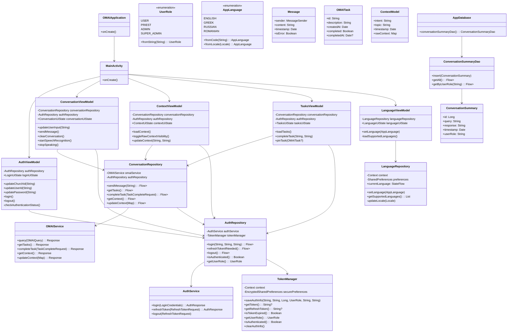

```mermaid
classDiagram
    %% Main Application Class
    class OMAIApplication {
        +onCreate()
    }

    %% Activities and UI
    class MainActivity {
        +onCreate()
    }

    %% ViewModels
    class AuthViewModel {
        -AuthRepository authRepository
        +LoginUiState loginUiState
        +updateChurchId(String)
        +updateUserId(String)
        +updatePassword(String)
        +login()
        +logout()
        -checkAuthenticationStatus()
    }

    class ConversationViewModel {
        -ConversationRepository conversationRepository
        -AuthRepository authRepository
        +ConversationUiState conversationUiState
        +updateUserInput(String)
        +sendMessage()
        +clearConversation()
        +startSpeechRecognition()
        +stopSpeaking()
    }

    class ContextViewModel {
        -ConversationRepository conversationRepository
        -AuthRepository authRepository
        +ContextUiState contextUiState
        +loadContext()
        +toggleRawContextVisibility()
        +updateContext(String, String)
    }

    class TasksViewModel {
        -ConversationRepository conversationRepository
        -AuthRepository authRepository
        +TasksUiState tasksUiState
        +loadTasks()
        +completeTask(String, String)
        +pinTask(OMAITask?)
    }

    class LanguageViewModel {
        -LanguageRepository languageRepository
        +LanguageUiState languageUiState
        +setLanguage(AppLanguage)
        -loadSupportedLanguages()
    }

    %% Repositories
    class AuthRepository {
        -AuthService authService
        -TokenManager tokenManager
        +login(String, String, String): Flow<Result<UserRole>>
        +refreshTokenIfNeeded(): Flow<Result<Boolean>>
        +logout(): Flow<Result<Boolean>>
        +isAuthenticated(): Boolean
        +getUserRole(): UserRole
    }

    class ConversationRepository {
        -OMAIService omaiService
        -AuthRepository authRepository
        +sendMessage(String): Flow<Result<Message>>
        +getTasks(): Flow<Result<TaskListResponse>>
        +completeTask(TaskCompleteRequest): Flow<Result<TaskResponse>>
        +getContext(): Flow<Result<ContextResponse>>
        +updateContext(Map<String, String>): Flow<Result<ContextResponse>>
    }

    class LanguageRepository {
        -Context context
        -SharedPreferences preferences
        +currentLanguage: StateFlow<AppLanguage>
        +setLanguage(AppLanguage)
        +getSupportedLanguages(): List<AppLanguage>
        -updateLocale(Locale)
    }

    %% Services
    class AuthService {
        +login(LoginCredentials): AuthResponse
        +refreshToken(RefreshTokenRequest): AuthResponse
        +logout(RefreshTokenRequest)
    }

    class OMAIService {
        +query(OMAIQuery): Response<OMAIResponse>
        +getTasks(): Response<TaskListResponse>
        +completeTask(TaskCompleteRequest): Response<TaskResponse>
        +getContext(): Response<ContextResponse>
        +updateContext(Map<String, String>): Response<ContextResponse>
    }

    %% Managers
    class TokenManager {
        -Context context
        -EncryptedSharedPreferences securePreferences
        +saveAuthInfo(String, String, Long, UserRole, String, String)
        +getToken(): String?
        +getRefreshToken(): String?
        +isTokenExpired(): Boolean
        +getUserRole(): UserRole
        +isAuthenticated(): Boolean
        +clearAuthInfo()
    }

    %% Data Models
    class UserRole {
        <<enumeration>>
        USER
        PRIEST
        ADMIN
        SUPER_ADMIN
        +fromString(String): UserRole
    }

    class AppLanguage {
        <<enumeration>>
        ENGLISH
        GREEK
        RUSSIAN
        ROMANIAN
        +fromCode(String): AppLanguage
        +fromLocale(Locale): AppLanguage
    }

    class Message {
        +sender: MessageSender
        +content: String
        +timestamp: Date
        +isError: Boolean
    }

    class OMAITask {
        +id: String
        +description: String
        +createdAt: Date
        +completed: Boolean
        +completedAt: Date?
    }

    class ContextModel {
        +intent: String
        +topic: String
        +timestamp: Date
        +rawContext: Map<String, String>
    }

    %% Database
    class AppDatabase {
        +conversationSummaryDao(): ConversationSummaryDao
    }

    class ConversationSummaryDao {
        +insert(ConversationSummary)
        +getAll(): Flow<List<ConversationSummary>>
        +getByUserRole(String): Flow<List<ConversationSummary>>
    }

    class ConversationSummary {
        +id: Long
        +query: String
        +response: String
        +timestamp: Date
        +userRole: String
    }

    %% Relationships
    OMAIApplication --> MainActivity
    
    MainActivity --> AuthViewModel
    MainActivity --> ConversationViewModel
    MainActivity --> ContextViewModel
    MainActivity --> TasksViewModel
    MainActivity --> LanguageViewModel
    
    AuthViewModel --> AuthRepository
    ConversationViewModel --> ConversationRepository
    ConversationViewModel --> AuthRepository
    ContextViewModel --> ConversationRepository
    ContextViewModel --> AuthRepository
    TasksViewModel --> ConversationRepository
    TasksViewModel --> AuthRepository
    LanguageViewModel --> LanguageRepository
    
    AuthRepository --> AuthService
    AuthRepository --> TokenManager
    ConversationRepository --> OMAIService
    ConversationRepository --> AuthRepository
    
    AppDatabase --> ConversationSummaryDao
    ConversationSummaryDao --> ConversationSummary
```